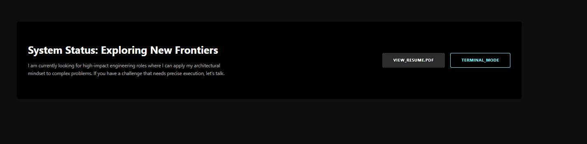

İyileştirme Önerileri:
Blog URL'leri: İçerikler İngilizce olduysa, URL'leri de İngilizce yap (örneğin /blog/mobile-app-development-strategies). SEO için önemli.
EmailJS Doğrulama: Form submit sonrası success/error mesajı ekle, kullanıcıya feedback ver.
Analytics: Vercel Analytics veya Google Analytics ekle, ziyaretçi takibi için.
Erişilebilirlik: Form alanlarına label'lar tam eklenmiş mi kontrol et (screen reader için).
Güvenlik: Formda reCAPTCHA ekle spam'e karşı.

KANKA BUNLARI YAPABILIYORSAK YAPALIM 

AYRICA BLOG KISMINDA SEARCH ARSCHIVE KISMI CALISMIYOR GALIBA 

KANKA BIR DE BLOG KISMINDAKI BLOGLARIN ICERIGINI BIRAZ DAHA PROF UST SEVIYE ICERIK YAPALIM AYNI  BU BLOGTA OLDUGU GIBI 
Architecting Cross-Platform Mobile Solutions: Strategic Frameworks for Enterprise-Grade Applications  BU BLOGTAKI GIBI PRF UST SEVIYE OALCAK SEKILDE DIGER BLOG SAYFLARIN ICERIGINIDE DUZELT VE SAGLA KANKA

VE BURAYI CALSIIR HALE GETIR 